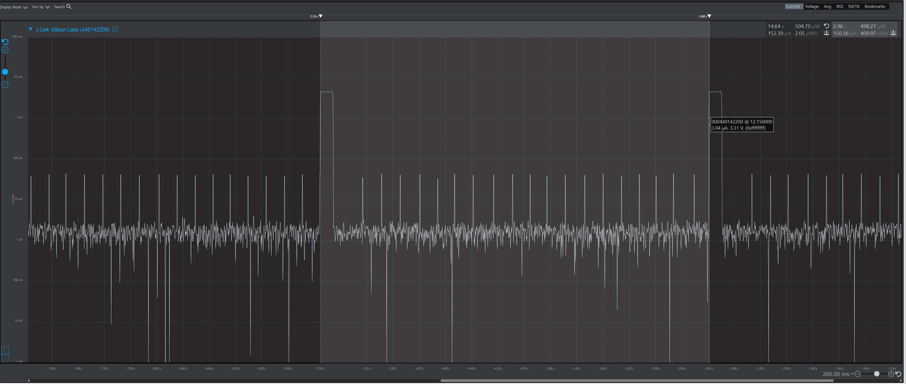
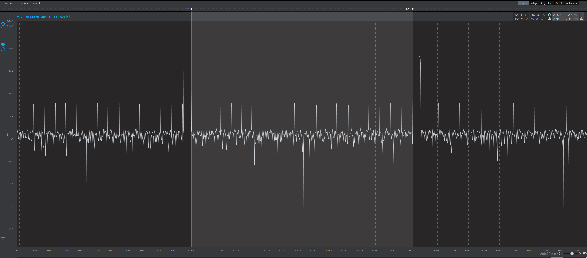
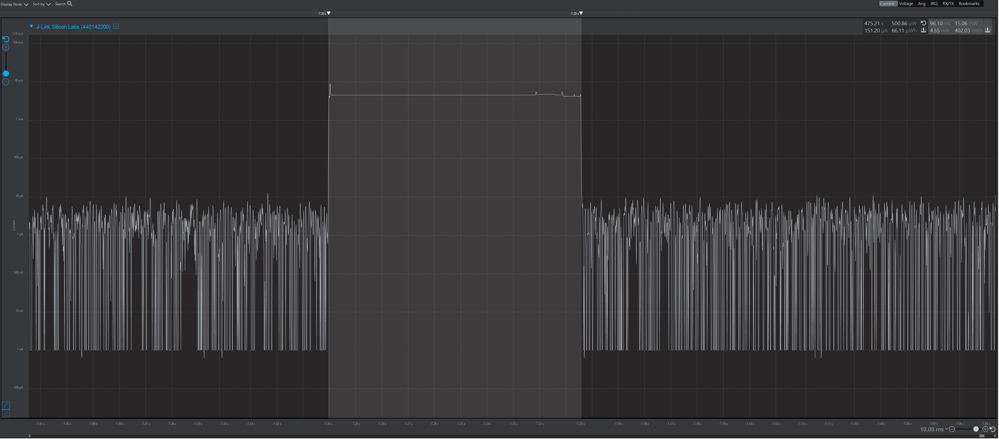

Please include your answers to the questions below with your submission, entering into the space below each question
See [Mastering Markdown](https://guides.github.com/features/mastering-markdown/) for github markdown formatting if desired.

*Be sure to take measurements in the "Default" configuration of the profiler to ensure your logging logic is not impacting current/time measurements.*

*Please include screenshots of the profiler window detailing each current measurement captured.  See [Shared document](https://docs.google.com/document/d/1Ro9G2Nsr_ZXDhBYJ6YyF9CPivb--6UjhHRmVhDGySag/edit?usp=sharing) for instructions.* 

1. What is the average current per period?   
   Answer: 150.36 uA
    Screenshot:  
     
2. What is the average current when the Si7021 is Load Power Management OFF?  
   Answer: 2.78 uA
    Screenshot:  
   
3. What is the average current when the Si7021 is Load Power Management ON?  
   Answer: 4.55 mA
    Screenshot:  
   
4. How long is the Si7021 Load Power Management ON for 1 temperature reading?  
   Answer: 96.10 ms
    Screenshot:  
   
