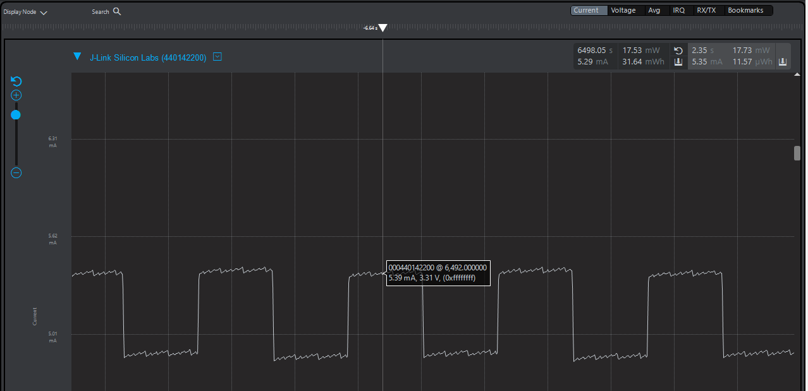
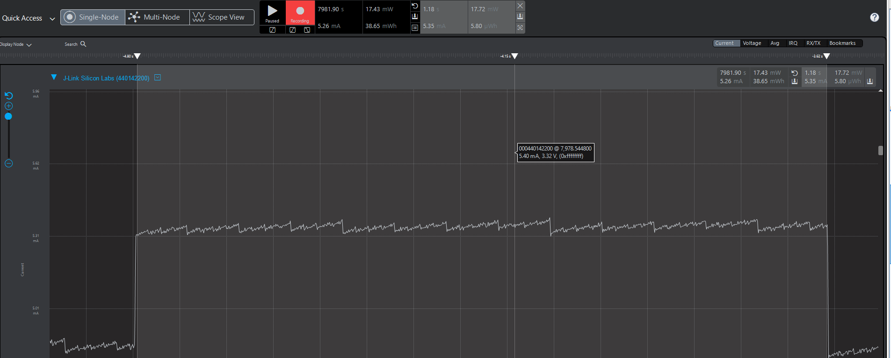
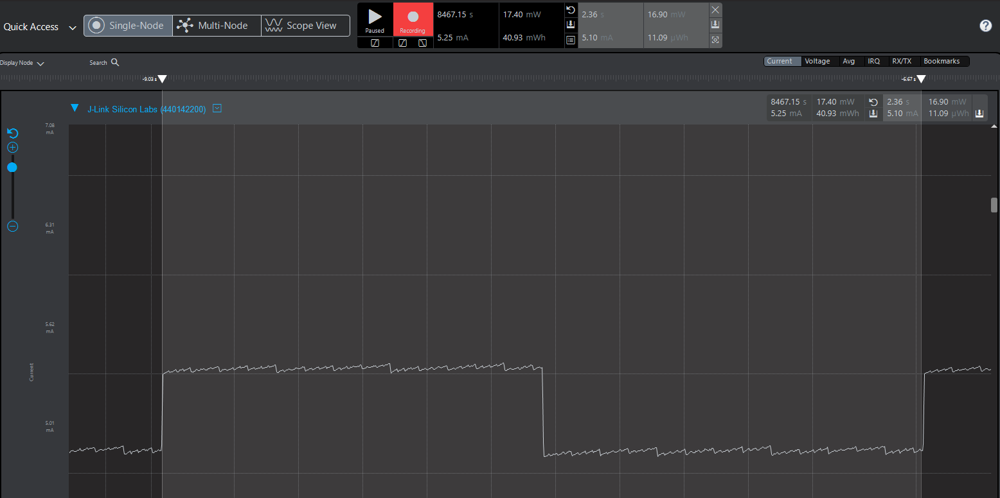
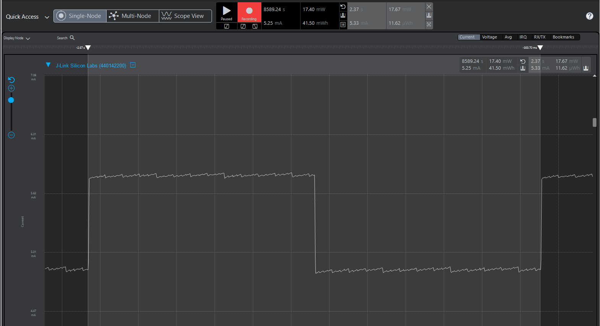

Please include your answers to the questions below with your submission, entering into the space below each question
See [Mastering Markdown](https://guides.github.com/features/mastering-markdown/) for github markdown formatting if desired.

**1. How much current does the system draw (instantaneous measurement) when a single LED is on with the GPIO pin set to StrongAlternateStrong?**

5.39 mA 

**2. How much current does the system draw (instantaneous measurement) when a single LED is on with the GPIO pin set to WeakAlternateWeak?**

5.40 mA

**3. Is there a meaningful difference in current between the answers for question 1 and 2? Please explain your answer, 
referencing the [Mainboard Schematic](https://www.silabs.com/documents/public/schematic-files/WSTK-Main-BRD4001A-A01-schematic.pdf) and [AEM Accuracy](https://www.silabs.com/documents/login/user-guides/ug279-brd4104a-user-guide.pdf) section of the user's guide where appropriate.**

No, there is no meaningful difference in the current drawn when a single LED is on with the GPIO pin in the StrongAlternateStrong or WeakAlternateWeak configurations. 
In either configuration, we see that the current drawn while the LED is off is about 4.90 mA, while the current jumps to 5.39 mA (for the StrongAlternateStrong case) and 5.40 mA (for the WeakAlternateWeak). This suggests that the LED itself only draws about 0.5 mA when it is on, regardless of the drive strength of the corresponding GPIO pin.
Per the AEM Accurary section of the BRD4104A user's guide, the AEM is accurate to within 0.1 mA for currents about 250 uA, it may be the case that the AEM reading is incorrect. For example, instead of 5.40 mA for the WeakAlternateWeak case, the _true_ current draw would be within a 5.30-5.50 mA range. However that uncertainty is not enough to convince me of any meaningful difference between the two operating modes.

**4. With the WeakAlternateWeak drive strength setting, what is the average current for 1 complete on-off cycle for 1 LED with an on-off duty cycle of 50% (approximately 1 sec on, 1 sec off)?**

5.10 mA

**5. With the WeakAlternateWeak drive strength setting, what is the average current for 1 complete on-off cycle for 2 LEDs (both on at the time same and both off at the same time) with an on-off duty cycle of 50% (approximately 1 sec on, 1 sec off)?**

5.33 mA

