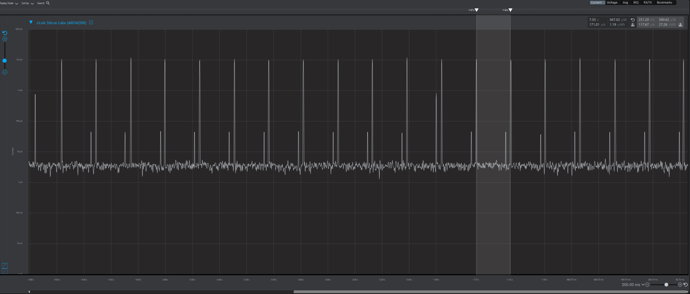
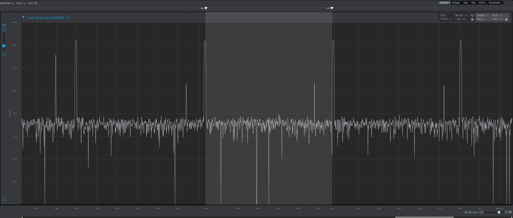
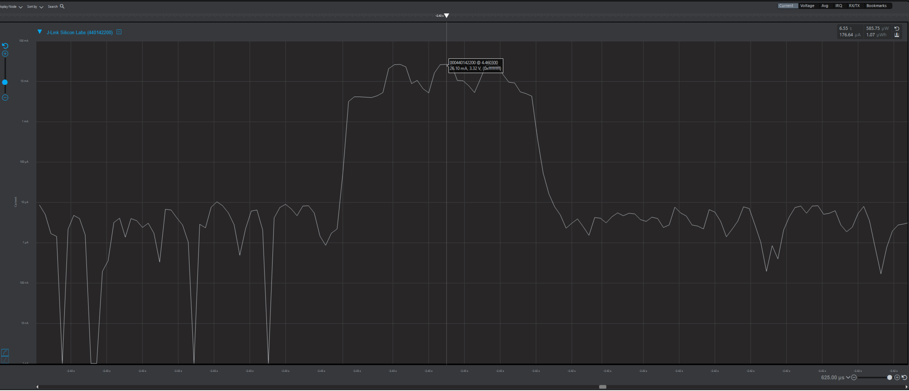
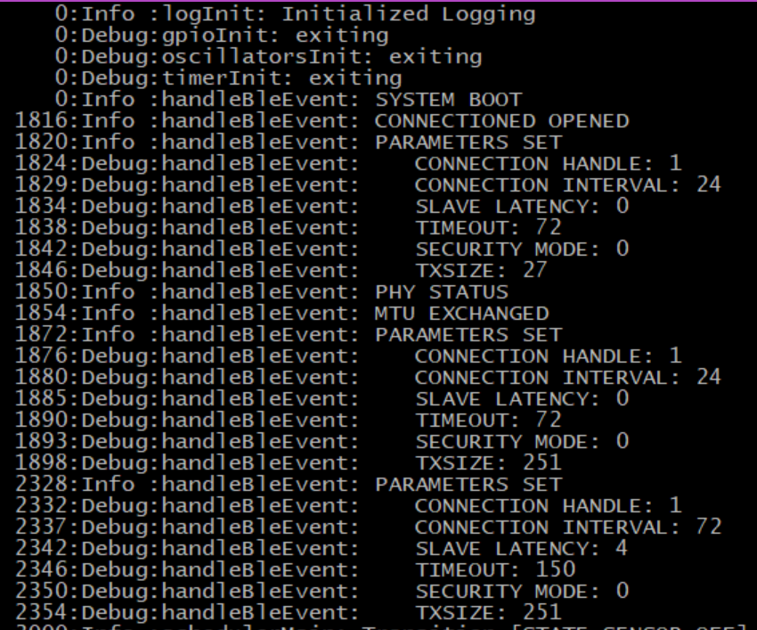
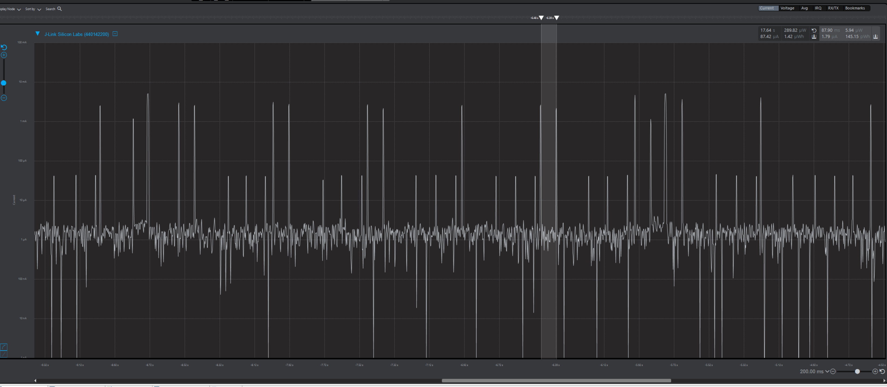
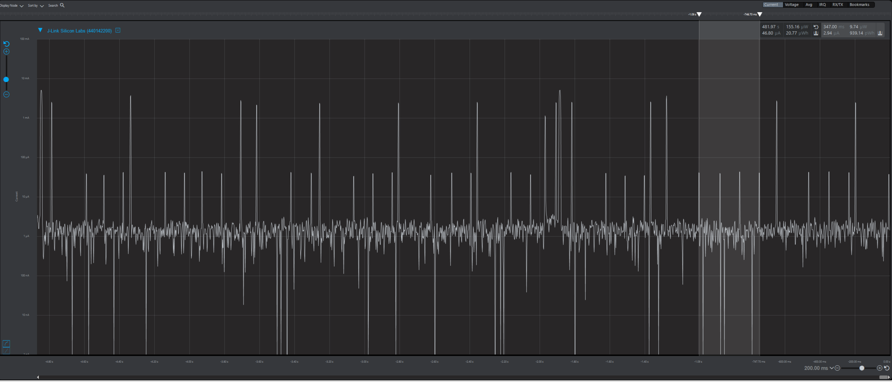
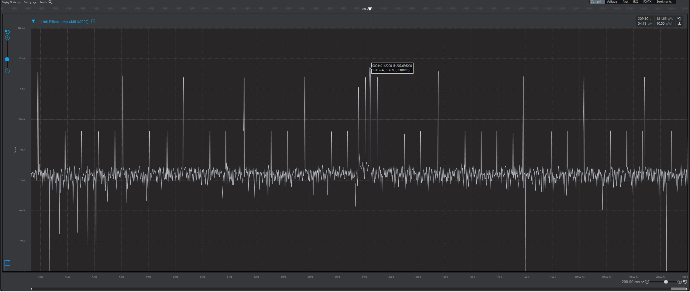
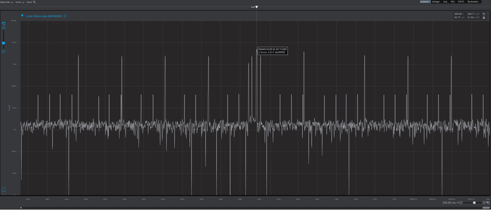

Please include your answers to the questions below with your submission, entering into the space below each question
See [Mastering Markdown](https://guides.github.com/features/mastering-markdown/) for github markdown formatting if desired.

*Be sure to take measurements in the "Default" configuration of the profiler to ensure your logging logic is not impacting current/time measurements.*

*Please include screenshots of the profiler window detailing each current measurement captured.  See [Shared document](https://docs.google.com/document/d/1Ro9G2Nsr_ZXDhBYJ6YyF9CPivb--6UjhHRmVhDGySag/edit?usp=sharing) for instructions.* 

1. Provide screen shot verifying the Advertising period matches the values required for the assignment.
    Answer: 251.20 ms
    Screenshot:  
     

2. What is the average current between advertisements?
   Answer: 5.82 uA.
    Screenshot:  
     

3. What is the peak current of an advertisement? 
   Answer: 26.10 mA
    Screenshot:  
     

4. Provide screen shot showing the connection interval settings. Do they match the values you set in your slave(server) code or the master's values?.
     My slave/server code attempted to set the connection parameters like so:
   - Connection interval: 75 ms.
   - Slave latency: 4 to enable the slave to be off the air for up to 4 connection intervals, or 300 ms.
   - Supervision timeout: 1500 ms (1.5 secs).
   
   The screenshot below shows that that master set the slave latency and timeout to the values requested, but the connection interval was larger than the requested 75 ms. Doing some math on the values returned to convert from the integer inputs to time units: 
   - Connection interval: 72 * 1.25 ms = 90 ms.
   - Slave latency: 4, enabling slave to be "off the air" for up to 4*90 ms = 360 ms.
   - Supervision timeout: 150 * 10 ms = 1500 ms (1.5 secs).

   So, the values for the slave latency and supervision timeout match the values I set in the slave/server code, but the connection interval was master's value. In other words, the master/client accepted the slave latency and timeout values I had requested, but modified the connection interval.
    Screenshot: 
     

5. What is the average current between connection intervals?
   Answer: 1.79 uA
    Screenshot:  
     

6. If possible, provide screen shot verifying the slave latency matches what was reported when you logged the values from event = gecko_evt_le_connection_parameters_id. 
    The screenshoot below shows four connection intervals where the slave took no action. After that last connection interval, which was ignored, the slave wakes up early and transmits data to the master. With a slave latency of four, the slave is allowed to ignore four connection events if it has no data to transmit, but it must transmit something before the next connection event occurs.
    Screenshot:  
     

7. What is the peak current of a data transmission when the phone is connected and placed next to the Blue Gecko? 
   Answer: 5.06 mA
    Screenshot:  
     
   
8. What is the peak current of a data transmission when the phone is connected and placed approximately 20 feet away from the Blue Gecko? 
   Answer: 5.18 mA
    Screenshot:  
     
   