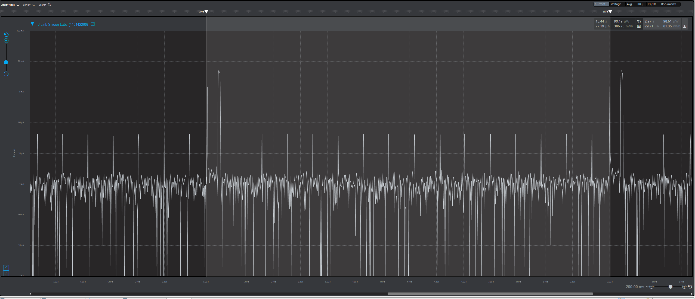
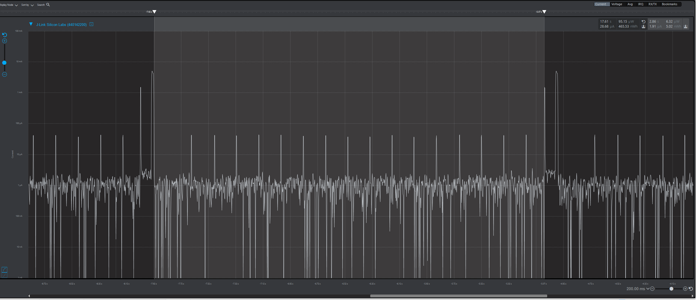
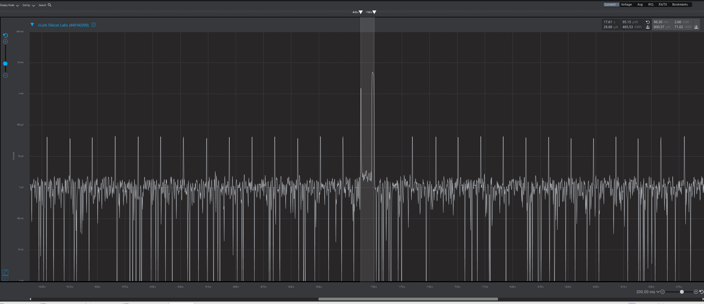

Please include your answers to the questions below with your submission, entering into the space below each question
See [Mastering Markdown](https://guides.github.com/features/mastering-markdown/) for github markdown formatting if desired.

*Be sure to take measurements in the "Default" configuration of the profiler to ensure your logging logic is not impacting current/time measurements.*

*Please include screenshots of the profiler window detailing each current measurement captured.  See [Shared document](https://docs.google.com/document/d/1Ro9G2Nsr_ZXDhBYJ6YyF9CPivb--6UjhHRmVhDGySag/edit?usp=sharing) for instructions.* 

1. What is the average current per period?
   Answer: 29.71 uA.
   <br>Screenshot:  
     

2. What is the average current when the Si7021 is Load Power Management OFF?
   Answer: 1.91 uA.
   <br>Screenshot:  
     

3. What is the average current when the Si7021 is Load Power Management ON?
   Answer: 800.57 uA.
   <br>Screenshot:  
     

4. How long is the Si7021 Load Power Management ON for 1 temperature reading?
   Answer: 96.30 ms.
   <br>Screenshot:  
     

5. What is the total operating time of your design for assignment 4 in hours assuming a 1000mAh supply?
The average current per period is 29.71 uA, so a 1000mAh supply would last: 
```math
1000 mAh / 29.71(10^-3) mA = 33658.7 hours
```

6. How has the power consumption performance of your design changed since the previous assignment?
The power consumption has decreased by a significant amount. The average current per period was reduced by a factor of 5 (150.36 uA / 29.71 uA). The average current when the Si7021 is on was reduced by over a factor of 5 (4.55 mA / 800.57 uA). The average current when the Si7021 is off went down as well, although just by a negligible 1 uA. 
The use of interrupts and sleeps in the implementation reduced our power consumption drastically, as compared to the polling solution of the previous assignment.

7. Describe how you have tested your code to ensure you are sleeping in EM1 mode during I2C transfers.
To verify that I was sleeping in EM1 mode during I2C transfers, I placed a breakpoint inside the `I2C0_IRQHandler()` function in `src/irq.c`. While executing the code in debug mode, I would step through the code after hitting the breakpoint I defined. After the interrupt is handled, control would return to the `SLEEP_Sleep()` SiLabs routine. In that context, the debugger would show me that the `modeEntered` was `sleepEM1`, meaning that I was sleeping EM1 mode before the interrupt occurred. That proved to me that during I2C transfers, I was correctly placing the board in EM1 mode to sleep.
I took a similar approach to verify that during the sleep delays from `timerWaitUs()` and while waiting for the next underflow interrupt, the system was sleeping in EM3 mode. To do that, I placed a breakpoint inside the `LETIMER0_IRQHandler()` when we would set the scheduler event that the set delay has passed (a COMP1 interrupt from LETIMER0). After stepping through the code, I would find that `modeEntered` in those cases was `sleepEM3`.
